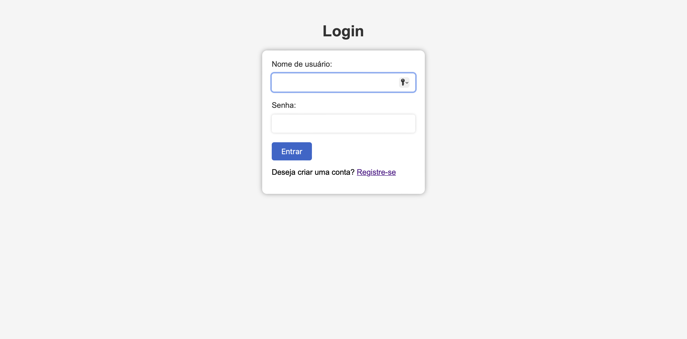
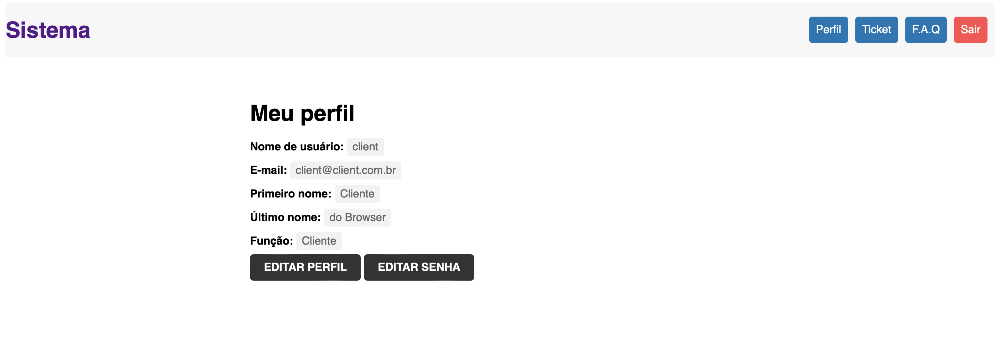
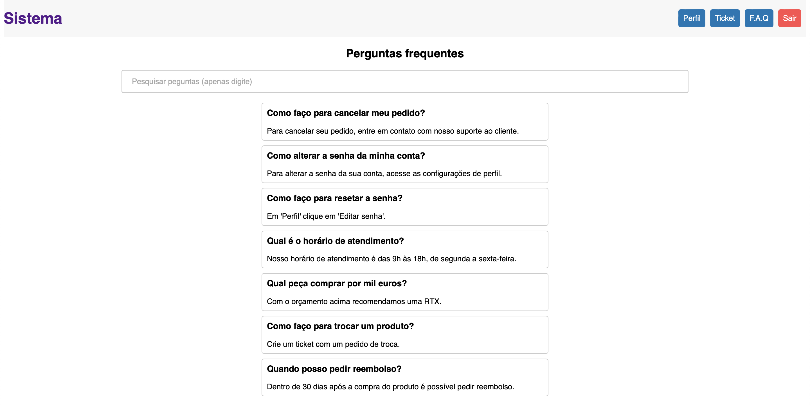
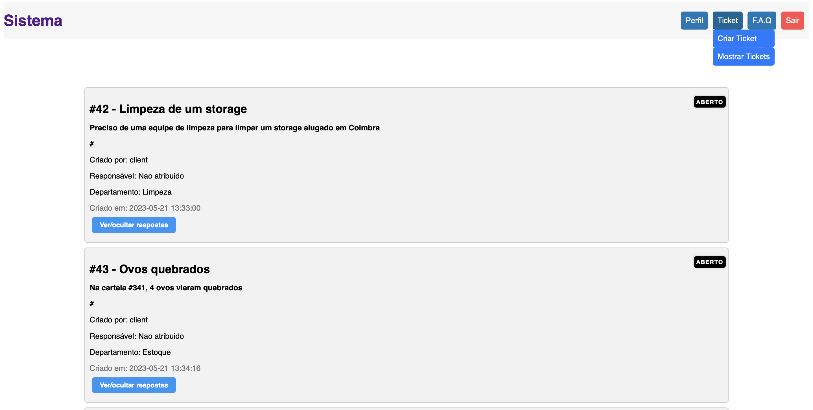
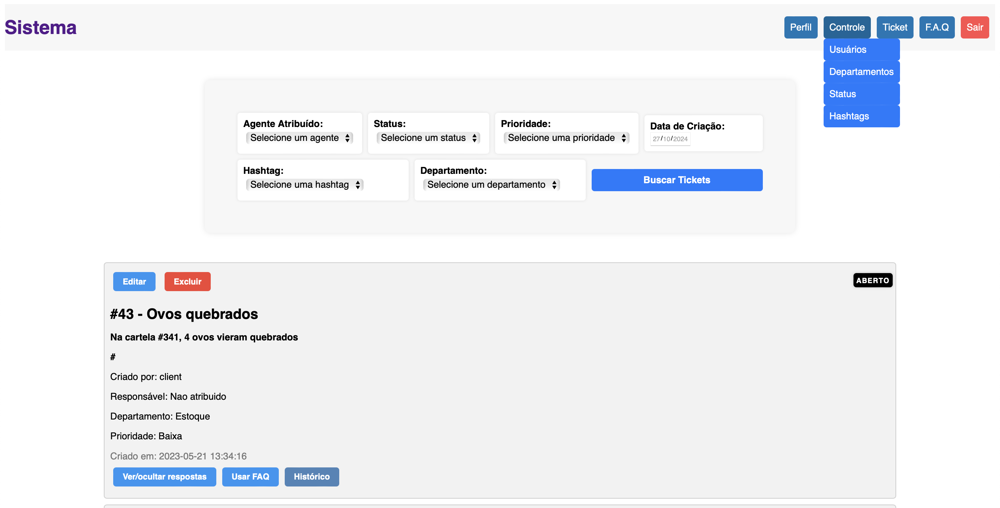
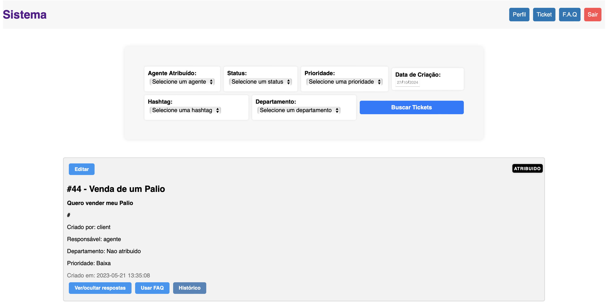
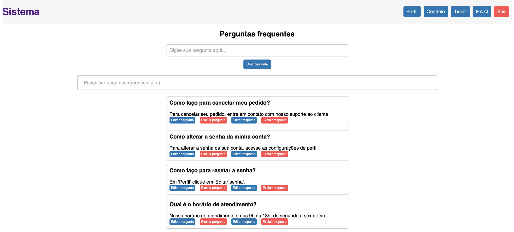

# Web Languages ​​and Technologies

## Trouble Tickets Website

### Objective

Develop a website to streamline and manage trouble tickets effectively. The system should enable users to submit, track, and resolve tickets promptly and efficiently. Additionally, the website should have intuitive user interfaces and reporting functionalities to provide real-time insights into ticket status and performance metrics. In order the create the website, we had to:

- Create an SQLite database that stores information about users, tickets, departments, hashtags, and frequently asked questions (FAQ).
- Create documents using HTML and CSS representing the application's web pages.
- Use PHP to generate those web pages after retrieving/changing data from the database.
- Use Javascript to enhance the user experience (for example, using Ajax).

The minimum expected set of requirements were the following:
- All users should be able to (users can simultaneously be clients and agents):
  - Register a new account
  - Login and Logout
  - Edit their profile (at least name, username, password, and e-mail)

- Clients should be able to:
  - Submit a new ticket optionally choosing a department (e.g., "Accounting")
  - List and track tickets they have submitted
  - Reply to inquiries (e.g., the agent asks for more details) about their tickets and add more information to already submitted tickets

- Agents should be able to (they are also clients):
  - List tickets from their departments (e.g., "Accounting"), and filter them in different ways (e.g., by date, by assigned agent, by status, by priority, by hashtag)
  - Change the department of a ticket (e.g., the client chose the wrong department)
  - Assign a ticket to themselves or someone else
  - Change the status of a ticket. Tickets can have many statuses (e.g., open, assigned, closed); some may change automatically (e.g., ticket changes to "assigned" after being assigned to an agent)
  - Edit ticket hashtags easily (just type hashtag to add (with autocomplete), and click to remove)
  - List all changes done to a ticket (e.g., status changes, assignments, edits)
  - Manage the FAQ and use an answer from the FAQ to answer a ticket

- Admins should be able to (they are also agents):
  - Upgrade a client to an agent or an admin
  - Add new departments, statuses, and other relevant entities
  - Assign agents to departments
  - Control the whole system

### Technologies Used

- HTML, CSS, PHP, Javascript, Ajax/JSON, PDO/SQL (using sqlite)

### Contributors 

- David Ferreira (up202006302)
- Luiz Queiroz (up202102362)
- Pedro Camargo (up202102365)

### Instructions
   
   
1. git clone https://github.com/FEUP-LTW-2023/project-ltw02g02.git or download the zip and unpack it
2. Navigate to the project directory 
3. Run php -S localhost:8080 -t public/
4. Go to any browser you want and write www.localhost:8080/login.html

### Credentials:

| Username | Password |
-----------|----------|  
| adm     | 123456    |
| agente  | 123456    |
| agente2 | 123456    |
| agente3 | 123456    |
| client  | 123456    |   
| client2 | 123456    |
| reg     | 123456    |

### ScreenShots

- Login:

- Profile:

- FAQ: 

- Tickets (Client View):

- Tickets (Adm View):

- Tickets (Agente View):

- FAQ (Adm and Agent View):

